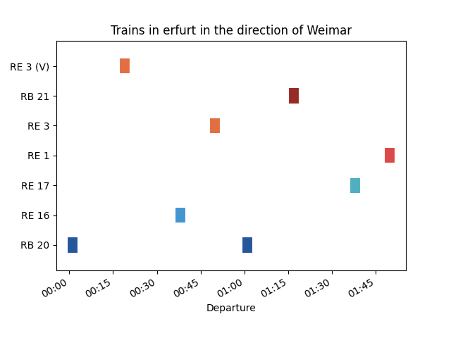

# Timetable-py
Generate timetable plots like this:




## Installation
A python version >= 3.8 is required. Install timetable-py with ``python setup.py install`` and run ``timetable-py`` or run the main.py with ``python main.py`` directly.

## Arguments
```
usage: timetable-py [-h] [-o OUTPUT] timetable via

Build timetable plots

positional arguments:
  timetable             Select a timetable in the timetables directory
  via                   Filter for via stops

options:
  -h, --help            show this help message and exit
  -o OUTPUT, --output OUTPUT
                        Save the plot as an image to a file instead of showing it
```

## Write timetable files
A timetable file is a [TOML](https://toml.io/en/) file with a `trains` list. Every `trains` item should be look like like this:
```toml
[[trains]]
name = "RB 20"
via = ["Weimar, "Naumburg", "Leipzig"] # it will be possible to filter for via stops
departure = ["00:01", "01:01"] # this means the train departures at minute 1 every hour. (if you try to show trains with a maximum 2 hour cycle that means you show 2 hours in your plot)
color = "#24589B"
``` 